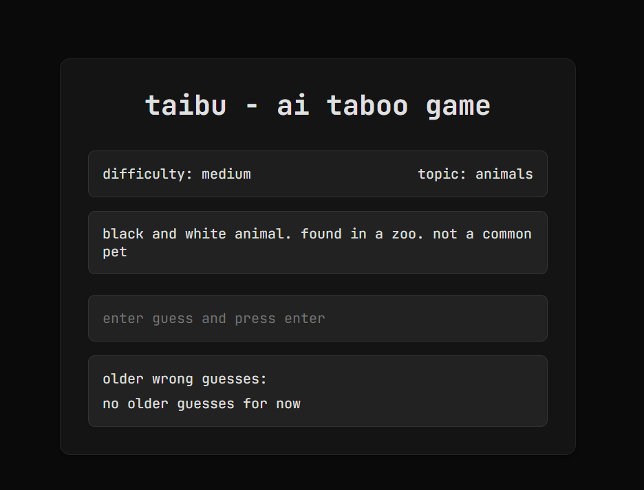

<div style="text-align: center;" align="center">
<a href="https://github.com/mdonmez/taibu">

</a>
<br>
<h1>taibu - AI Taboo Game</h1>
<p>
An AI-powered intelligent Taboo game that creates card sets dynamically from custom topics and difficulty levels.
</p>

</div>

## Features
- Dynamic word generation based on user-selected topics and difficulty levels
- Intelligent hint generation system that adapts to previous guesses
- Real-time gameplay with instant feedback
- Multiple difficulty levels for varied challenge
- Custom topic selection for personalized gaming experience
- Maximum 5 attempts per word

## Usage
- Select a topic and difficulty level
- Click "Start Game" to receive your first hint
- Type your guess and press Enter
- Get new hints based on your previous guesses
- Win by guessing the word within 5 attempts

## Operation Logic
The game works in two main stages:

**Word Generation:**
- The user chooses the topic and the difficulty
- AI generates a target word and its banned words
- The system validates and prepares the game session

**Hint Generation:**
- AI provides contextual clues based on vocabulary and banned words
- Each wrong guess triggers a new, more specific hint
- Previous predictions are taken into account when generating new hints
- Preventing the new hint from being the same as previous hints
- The game ends after the correct guess or maximum attempts are reached

## Technology Stack
- **Backend:** Flask (Python)
- **Frontend:** JavaScript, HTML, CSS
- **AI Integration:** OpenAI API compatible service
- **Data Handling:** JSON for API communications

## Setup
### Requirements
- Python 3.12+
- OpenAI API key (or compatible)

### Installation
```bash
git clone https://github.com/mdonmez/taibu.git
cd taibu
pip install -r requirements.txt
```

### Configuration
Create a `.env` file with the following:
```bash
BASE_URL=your_api_base_url
API_KEY=your_api_key
MODEL_NAME=your_model_name
```

### Usage
```bash
python app.py
```
Then visit the web user interface to start using the app. (Default: http://127.0.0.1:5000/)

Or just go to the hosted version: [taibu](https://taibu.onrender.com/)

Also there is main.py file for running app without web interface, instead using console.

## License
This project is licensed under the MIT License - See [LICENSE](LICENSE) for details.

## Notes
I mostly used AI to make this game.