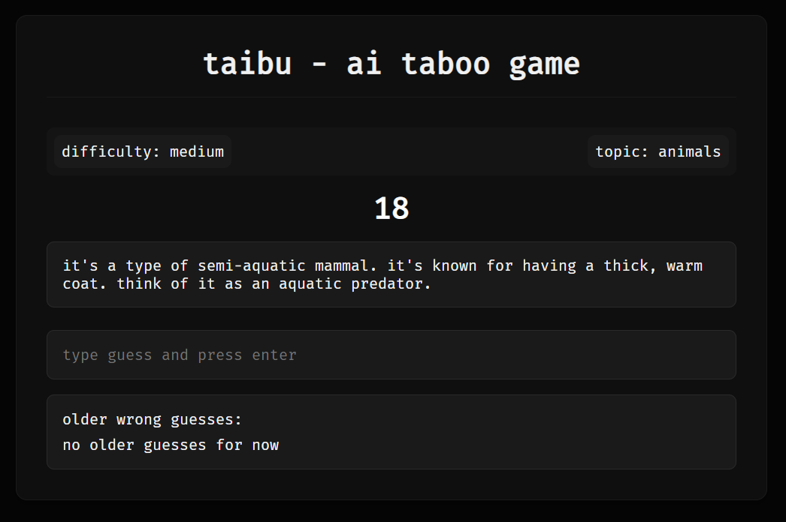

<div align="center">
  <a href="https://github.com/mdonmez/taibu">
    
  </a>
  <br>
  <h1>taibu - AI Taboo Game</h1>
  <p>
    An AI-powered intelligent Taboo game that creates card sets dynamically from custom topics and difficulty levels.
  </p>
  
</div>

## Overview

taibu is an ai-driven taboo game in which the user tries to guess a secret word generated by ai based on ai-generated clues while avoiding certain “forbidden” words generated by ai. The game provides a personalized gaming experience by dynamically generating word sets based on user-selected topics and difficulty levels.

## Features

-   **Dynamic Word Generation:** AI generates target words and corresponding banned words based on the chosen topic and difficulty.
-   **Intelligent Hint Generation:** The AI provides contextual hints that adapt to previous guesses, becoming more specific with each wrong attempt.
-   **Real-time Gameplay:** Instant feedback is provided as players make guesses.
-   **Multiple Difficulty Levels:** Options for easy, medium, and hard difficulties offer varied levels of challenge.
-   **Custom Topic Selection:** Users can specify topics for a personalized gaming experience.
-   **Limited Attempts:** Each word can be attempted a maximum of 5 times.
-   **Timer:** Each round has a timer to add to the challenge.
-   **Similarity Check:** Guesses are checked for similarity to the target word, allowing for approximate wins.
-   **User Interface:** The game features a user-friendly interface with a setup screen, a game screen showing hints and input fields, and a result screen.

## How to Play

1.  **Setup:**
    - Select a difficulty level from the dropdown (easy, medium, or hard).
    - Enter a topic (e.g., foods, animals, countries, etc.) in the text field.
    - Click the "Start Game" button.
2.  **Gameplay:**
    - The game will display a hint for the secret word.
    - Type your guess in the input field and press Enter.
    - If your guess is incorrect, a new, more specific hint will be generated.
    - Previous wrong guesses are displayed for reference.
    - The game ends when you correctly guess the word, make a close guess, run out of attempts, or if the timer runs out.
3.  **Results:**
    - The result screen will display whether you won or lost.
    - Banned words for the round will be displayed for review.
    - You can click the "Replay" button to start a new game with the same topic and difficulty.

## Operation Logic

The game logic is handled by the `TabooGame` class in `app.py` and operates in two main stages, with client-side interactions managed by `static/script.js`:

**Word Generation:**

-   The user initiates the game setup through the HTML interface (`templates/index.html`), selecting a difficulty and providing a topic.
-   Upon clicking "Start Game," `static/script.js` sends a POST request to the `/game` endpoint with the selected difficulty and topic.
-   The Flask backend (`app.py`) receives the request and, within the `start_game` function, creates a `game_config` object.
-   The `generate_taboo` method of the `TabooGame` class is called with the `game_config`. This method:
    -   Loads a system prompt from `system_prompts/system_prompt_wordgen.txt`, which guides the AI in generating the word and banned words.
    -   Sends a request to the OpenAI API (or a compatible service) using the specified model (defined in `.env` as `MODEL_NAME`). The request includes the system prompt and user-provided topic and difficulty.
    -   Receives the AI's JSON response, which includes the target word and a list of banned words.
    -   Parses the JSON response, extracts the target word and banned words, and stores the target word in `self.current_word`. The method then returns a dictionary containing `word` and `banned` properties.
-   The backend responds with the generated word and banned words as a JSON object to the frontend.
-   The frontend (`static/script.js`) stores these properties in `this.gameProps` and transitions to the game screen, displaying the difficulty and topic.

**Hint Generation:**

-   After the game screen is displayed, `static/script.js` calls the `/hints` endpoint to request a new hint.
-   The `get_hint` function in `app.py` is called, which receives a `props` object (containing the target word and banned words) and an optional list of `previous_guesses`.
-   The `generate_hint` method is called within the `TabooGame` class. This method:
    -   Loads a system prompt from `system_prompts/system_prompt_hintgen.txt`, which guides the AI in hint generation.
    -   Sends a request to the OpenAI API using the specified model, including the system prompt, the current word, banned words, and previous guesses.
    -   Parses the AI's response to extract a new hint. If the response is not a standard JSON, it attempts to clean and extract the hint.
    -   Returns the new hint as a string to the `/hints` endpoint.
-   The backend responds with the hint as a JSON object, including a "hint" key.
-   The frontend (`static/script.js`) receives the hint, which is displayed in the hint box with a fade-in effect, and sets the hint box height dynamically based on the hint length.
-   When the user makes a guess, `static/script.js` calculates the similarity with the target word using the Levenshtein distance. If the similarity exceeds a threshold (default %70) (defined by `SIMILARITY_THRESHOLD` in `static/script.js`), the game ends with a win.
-   If the guess is incorrect, the guess is added to the `previousGuesses` list, and the game requests a new hint via the `/hints` endpoint.
-   This process continues until the player guesses the target word or the maximum number of attempts is reached, or the timer runs out, which is managed by the `startTimer` function in `static/script.js`.

## Technology Stack

-   **Backend:** FastAPI (Python)
-   **Frontend:** JavaScript, HTML, CSS
-   **AI Integration:** OpenAI API compatible service
-   **Data Handling:** JSON for API communications

## Setup

### Requirements

-   Python 3.12+
-   OpenAI API key (or compatible)

### Installation

```bash
git clone https://github.com/mdonmez/taibu.git
cd taibu
pip install -r requirements.txt
```

### Configuration

Create a `.env` file with the following:

```bash
BASE_URL=your_api_base_url
API_KEY=your_api_key
MODEL_NAME=your_model_name
```

### Usage

```bash
python app.py
```

Then visit the web user interface to start using the app. (Default: http://127.0.0.1:5000/)

Or just go to the hosted version: [taibu](https://taibu.onrender.com/)

Also there is `main.py` file for running app without web interface, instead using console.

## License

This project is licensed under the MIT License - See [LICENSE](LICENSE) for details.

## Notes

This game was primarily developed using AI.
